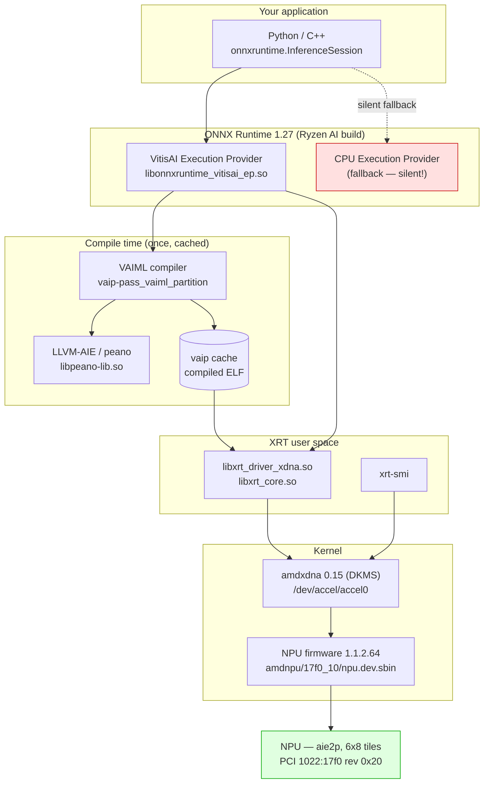
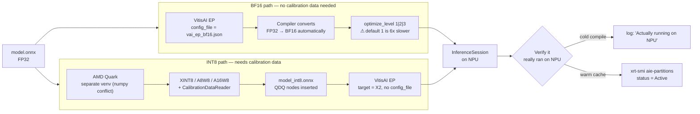

# Running an ONNX Model on the Ryzen AI NPU (Linux) — Workflow Guide

**Target:** AMD Ryzen Embedded V4A46X / Krackan Point NPU (`npu6`), Ubuntu 24.04, kernel 7.0.0-28
**Software:** Ryzen AI 1.8.0 for Linux, XRT 2.25.37, amdxdna DKMS 0.15
---

## 1. The stack



The red box is the thing to watch: if the VitisAI EP fails to load for any reason, ONNX
Runtime falls back to CPU silently, prints one error line, and still exits 0.

---

## 2. Model conversion flow



**Choosing a path:**

| | BF16 | INT8 |
|---|---|---|
| Calibration data | not required | required (100–1000 representative samples) |
| Accuracy risk | low | depends entirely on calibration set |
| Compile time (OI) | 803 s at opt3 | ~7 s |
| Throughput (OI) | 16.8 FPS | 42.1 FPS |
| Marginal power (OI) | 1.42 W | 5.96 W |
| Tuning sensitivity | (`optimize_level`) | minimal |

Start with BF16: it is the lower-risk path and requires no data. Move to INT8 when you have a
calibration set and need the throughput.

---

## 3. Installation

### Step 0 — Confirm the hardware and platform

```bash
lspci -nn | grep -i "signal process"        # expect 1022:17f0 (or 1022:1502 on Phoenix)
cat /sys/class/accel/accel0/device/vbnv     # e.g. RyzenAI-npu6
. /etc/os-release && echo "$PRETTY_NAME"    # Ubuntu 24.04.x
python3.12 --version                        # 3.12.x required
```

BF16 requires STX/KRK or newer. Phoenix/Hawk Point are INT8-only for this flow.

### Step 1 — XRT + NPU driver (needs root)

Download `RAI_1.8_Linux_NPU_XRT.zip` — this one is **not** login-gated:

```bash
wget https://download.amd.com/opendownload/RyzenAI/Driver/RAI_1.8_Linux_NPU_XRT.zip
unzip RAI_1.8_Linux_NPU_XRT.zip
```

> **DOC  — `curl` may not be installed.** The docs assume it. Ubuntu Server images
> frequently ship only `wget`. If `curl` returns nothing with an empty status code, it does not
> exist; it is not a network problem.

Install XRT then the DKMS plugin:

```bash
sudo apt install -y dkms linux-headers-$(uname -r)
cd RAI_1.8_Linux_NPU_XRT
sudo apt install --fix-broken -y ./xrt_202620.2.25.37_24.04-amd64-base.deb
sudo apt install --fix-broken -y ./xrt_202620.2.25.37_24.04-amd64-base-dev.deb
sudo apt install --fix-broken -y ./xrt_202620.2.25.37_24.04-amd64-npu.deb
sudo apt install --fix-broken -y ./xrt_plugin.2.25.260102.56.release_24.04-amd64-amdxdna.deb
```

> **boost version.** The docs say to install `libboost-filesystem1.74.0`. On
> Ubuntu 24.04 the package actually depends on 1.83, which `apt` resolves automatically.
> The documented command fails because 1.74 does not exist on noble. Just skip it.

> **the DKMS plugin replaces your running kernel module.** Its `postinst` runs
> `rmmod amdxdna`, builds DKMS 0.15, and reloads. Ubuntu 24.04 with kernel 7.0 ships an
> *in-tree amdxdna 0.7.0 which enumerates the NPU fine but cannot execute* — commands
> abort with `ERT_CMD_STATE_ABORT` and the kernel logs
> `xdna_mailbox: Message callback ret -22`. The DKMS module is mandatory, not optional.
> It also installs newer firmware (`npu.dev.sbin`, 1.1.2.64 vs in-tree 1.0.0.63) — driver and
> firmware are versioned together and must not be mixed.

> **Note on device permissions.** The plugin installs
> `/etc/udev/rules.d/99-amdxdna.rules` with `MODE="0666"` — world-writable. If you prefer least
> privilege, replace it with
> `KERNEL=="accel*",DRIVERS=="amdxdna",GROUP="render",MODE="0660"` and add your user to
> `render` (requires a full logout/login).

Verify:

```bash
source /opt/xilinx/xrt/setup.sh
xrt-smi examine          # must list the device
xrt-smi validate --run latency    # must PASS
```

If `examine` lists the NPU but `validate` fails, you are still on the in-tree driver.

### Step 2 — Ryzen AI 1.8.0

`ryzen_ai-1.8.0.tgz` (7.3 GB) — download it through a browser from
`account.amd.com`. 

```bash
mkdir -p ryzen_ai-1.8.0 && tar -xzf ryzen_ai-1.8.0.tgz -C ryzen_ai-1.8.0
cd ryzen_ai-1.8.0
./install_ryzen_ai.sh -a yes -p /opt/ryzenai/venv
```

Takes about a minute. It creates the venv and installs `uv` inside it.

> **ignore the `/usr/include/asm` warning.** The installer says to run
> `sudo ln -s /usr/include/asm-generic /usr/include/asm`. **Do not do this on Ubuntu 24.04
> amd64.** `/usr/include/x86_64-linux-gnu/asm` already exists and gcc finds it via the
> multiarch include path (verify: `echo '#include <asm/types.h>' | gcc -E - >/dev/null`).
> The suggested symlink would shadow architecture-specific headers with generic ones. It is
> Ubuntu 22.04 advice and the installer prints it unconditionally.

### Step 3 — The environment (order is load-bearing)

```bash
source /opt/ryzenai/venv/bin/activate
source /opt/xilinx/xrt/setup.sh          # MUST come after activate
export LD_LIBRARY_PATH=/lib/x86_64-linux-gnu:${RYZEN_AI_INSTALLATION_PATH}/onnxruntime/lib/:$LD_LIBRARY_PATH
export LD_LIBRARY_PATH=$LD_LIBRARY_PATH:${RYZEN_AI_INSTALLATION_PATH}/lib/python3.12/site-packages/lnx64.o/tools/peano/lib
```

> **the peano path is missing from the documentation and it is not optional.**
> `libonnxruntime_vitisai_ep.so` needs `libpeano-lib.so.21.0git`, which ships in
> `site-packages/lnx64.o/tools/peano/lib` — a directory the documented `LD_LIBRARY_PATH` does
> not include. Without it the EP fails to load and ONNX Runtime silently runs on CPU while
> still printing `Test Finished` and exiting 0.
> It is a transitive dependency, so `objdump -p ... | grep NEEDED` will **not** show it —
> `NEEDED` lists only direct dependencies. Only an actual load reveals the problem.

> **Why `setup.sh` must come after `activate`:** the venv puts `voe/lib` early on
> `LD_LIBRARY_PATH`, and it ships `libxrt_coreutil.so.2.19.184` which lacks a symbol present in
> the system 2.25.37. `setup.sh` prepends `/opt/xilinx/xrt/lib` so the newer one wins. In the
> wrong order you get a core dump reported as "failed to open library" that is really an
> undefined-symbol error — the file exists and `ldd` resolves it fine.

Verify:

```bash
python -c "import onnxruntime as ort; print(ort.get_available_providers())"
# must contain VitisAIExecutionProvider
```

### Step 4 — Validate with AMD's quicktest

```bash
cd $RYZEN_AI_INSTALLATION_PATH/quicktest && python quicktest.py 2>&1 | tee quicktest.log
```

> **`Test Finished` does not mean success.** Always check:
> ```bash
> grep "Actually running on NPU" quicktest.log   # must be >= 1
> grep -cE "\[E:|\[F:" quicktest.log             # must be 0
> ```

---

## 4. Compiling and running your model

### BF16

`vai_ep_bf16.json`:

```json
{
  "passes": [
    { "name": "init", "plugin": "vaip-pass_init" },
    { "name": "vaiml_partition", "plugin": "vaip-pass_vaiml_partition",
      "vaiml_config": { "optimize_level": 3, "preferred_data_storage": "auto" } }
  ],
  "target": "VAIML",
  "targets": [ { "name": "VAIML", "pass": ["init", "vaiml_partition"] } ]
}
```

```python
import onnxruntime as ort

options = ort.SessionOptions()
options.log_severity_level = 1          # required to see partitioning markers

session = ort.InferenceSession(
    "model.onnx",
    sess_options=options,
    providers=["VitisAIExecutionProvider"],
    provider_options=[{
        "config_file": "vai_ep_bf16.json",
        "cache_dir": "/path/to/cache",
        "cache_key": "my_model",
        "enable_cache_file_io_in_mem": "0",   # REQUIRED for BF16
    }],
)
```

> **`optimize_level` defaults to 1 and that is 6× slower.** For our model,
> level 1 gave 2.80 FPS and level 3 gave 17.05 FPS from the identical source model.
> At level 1 the NPU was *slower than the CPU*. The documented "default config" uses level 1.
>
> By contrast `preferred_data_storage` — which the docs highlight as the CNN-oriented knob —
> made no measurable difference (352.37 vs 352.33 ms).

> **`enable_cache_file_io_in_mem` defaults to `1`, which is INT8-only.** BF16 requires `"0"`
> (persist to disk) or compilation will not behave as documented.

### INT8

Quantization must happen in a separate virtualenv:

> **`amd-quark` and `flexml` have irreconcilable dependencies.**
> `amd-quark` requires `numpy>=2.0`; `flexml` (the BF16 compiler, part of Ryzen AI) pins
> `numpy<=1.26.4`. Installing Quark into the Ryzen AI venv breaks ONNX Runtime entirely
> (`ImportError: import numpy failed`). Quantization is offline, so use a separate venv.
> Recovery if you already did it: `pip uninstall -y amd-quark && pip install numpy==1.26.4`.

```bash
python3.12 -m venv /opt/quark-venv
/opt/quark-venv/bin/pip install amd-quark onnx onnxruntime
/opt/quark-venv/bin/pip install torch --index-url https://download.pytorch.org/whl/cpu
```

`torch` is undocumented but required — Quark JIT-compiles custom ops against it.

```python
from quark.onnx import ModelQuantizer
from quark.onnx.quantization.config.config import Config
from quark.onnx.quantization.config.custom_config import get_default_config

config = Config(global_quant_config=get_default_config("XINT8"))
ModelQuantizer(config).quantize_model("model.onnx", "model_int8.onnx", calibration_reader)
```

Your `calibration_reader` needs `get_next()` returning `{input_name: ndarray}` and `rewind()`.

Running INT8 uses different provider options — no `config_file`:

```python
provider_options=[{
    "cache_dir": "/path/to/cache",
    "cache_key": "my_model_int8",
    "enable_cache_file_io_in_mem": "0",
    "target": "X2",        # X2 = STX/KRK default. X1 = legacy, required on PHX/HPT
    "opt_level": "3",
}]
```

Do not set `xclbin` on STX/KRK — it is only for Phoenix/Hawk Point.

---

## 5. Verifying it actually ran on the NPU

This is the step people skip, and it is the one that invalidates results.

Cold compile — partitioning markers (needs `log_severity_level = 1`):

```
[Vitis AI EP] No. of Operators :
 VAIML   122            <- BF16 target label
[Vitis AI EP] No. of Subgraphs :
   NPU     1
Actually running on NPU      1
```

> **the BF16 target is labelled `VAIML`, not `NPU`.** The INT8 flow reports
> `NPU` / `VITIS_EP_CPU`. 

> Markers only appear on a cold compile. A warm-cache load compiles nothing and prints
> nothing — absence of markers is not evidence of CPU fallback.

Warm cache — ask the driver instead:

```bash
xrt-smi examine --report aie-partitions
```

```
Partition Index : 0    Columns: [0,1,2,3,4,5,6,7]
HW Contexts:
  PID 103599 | Ctx ID 1 | Status Active | Submissions 199 | Completions 198 | GOPS 84
```

Idle reads `No hardware contexts running on device`.


**Per-operator assignment report:**

```bash
export XLNX_ONNX_EP_REPORT_FILE=vitisai_ep_report.json   # plus enable_cache_file_io_in_mem=0
# written into the cache directory on compile
```

```json
{"name": "NPU", "nodeNum": 484, ...}
{"name": "VITIS_EP_CPU", "nodeNum": 2, "supportedOpType": ["::DequantizeLinear", "::QuantizeLinear"]}
```

Two CPU nodes on an INT8 model are normal — they are the boundary quantize/dequantize.

---

## 6. Measuring power

Two useful sensors, both world-readable, no root needed:

```bash
cat /sys/class/hwmon/hwmon3/power1_input   # amdgpu "PPT" — whole SoC package, µW
cat /sys/class/hwmon/hwmon4/power1_input   # amdxdna "NPU_power" — NPU rail, µW
```

Confirm which hwmon index is which with `cat /sys/class/hwmon/hwmon*/name`; the numbering is
not stable across boots.

RAPL (`/sys/class/powercap/.../energy_uj`) is **root-only** (`-r--------`) and not usable
unprivileged.

Always capture an idle baseline — on this board idle PPT is 8.04 W, which is most of the
reading during efficient NPU inference. Reporting total power without the baseline
overstates inference cost substantially.

---
